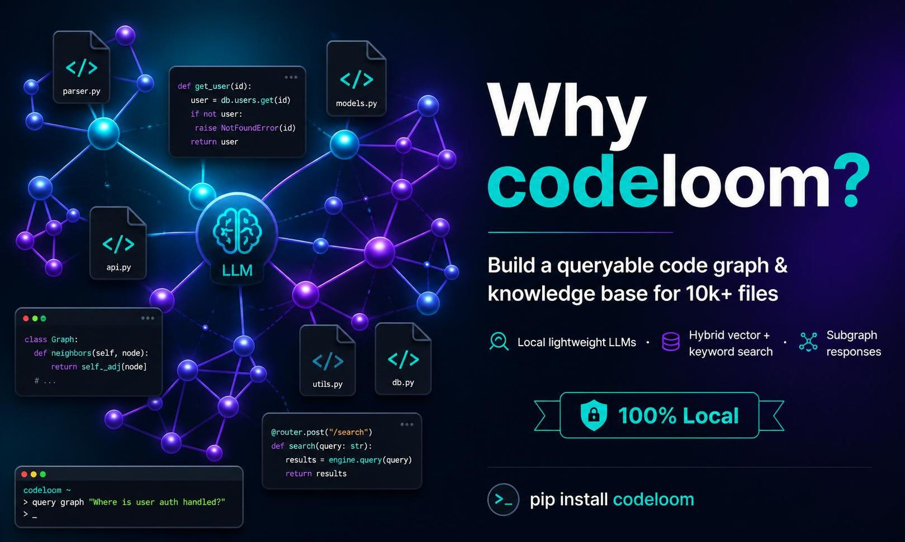

<p align="center">
<h1 align="center">codeloom</h1>
  <p align="center">
    "With codeloom, your coding agent knows what to read."
  </p>
</p>

<p align="center">
  <a href="https://github.com/algodesigner/codeloom/actions"></a>
  <a href="https://pypi.org/project/codeloom/"></a>
  <a href="https://github.com/algodesigner/codeloom/blob/main/LICENSE"></a>
  
  
</p>

<p align="center">
  
</p>

---

AI coding agents are powerful but fundamentally blind to your codebase structure. When your agent edits `validate_token()`, it has no idea that 47 callers depend on its return type. When it searches for "database connection", it greps blindly through every file. Without a code graph, your agent works like a surgeon operating without an X-ray, skilled but guessing at what's inside.

**codeloom** builds a queryable code graph from your entire codebase, every function, class, import, call, and document, and exposes it to your AI agent. One install, and your agent stops grepping and starts understanding.

## Quick Start

```bash
pip install codeloom

cd your-project/
codeloom opencode install    # for OpenCode
# or: codeloom claude install  # for Claude Code
```

Then tell your agent:

> "Build a code graph for this project"

That's it. The graph auto-rebuilds when your session ends. No extra tokens, no extra commands, everything runs 100% locally.

---

## What Changes

| Before (grep) | After (codeloom) |
|---|---|
| Finds exact strings, misses semantic connections | Finds conceptually related code via vector + keyword + graph |
| Returns a flat list of file matches | Returns seeds **plus a subgraph** showing how they connect |
| No way to know what depends on what | `codeloom impact "validate_token"`, finds all 47 callers instantly |
| Agent operates blind, guesses at relationships | Agent sees the full picture before making edits |

Every search returns results like this:

```
seeds:
codeloom/core/pipeline.py:71
  │ def run_pipeline(source_dir: Path, ...) -> PipelineResult:
  │     """Run the full code graph build pipeline."""
storage/store.py:20
  │ class KnowledgeStore:

edges:
codeloom/core/pipeline.py:71 -calls-> storage/store.py:20
codeloom/core/pipeline.py:0 -defines-> codeloom/core/pipeline.py:71
```

Seeds tell you *where* relevant code lives. Edges tell you *how it connects*. Together they give your agent the full picture, no separate Read calls needed.

---

## 15 MCP Tools at a Glance

Three categories, one MCP server.

### Search
| Tool | What it does |
|------|-------------|
| `search` | 5-signal HybridRAG, vector + keyword + graph + community fused into one ranking |
| `search_keyword` | FTS5 keyword-only (BM25), instant results for known names |
| `search_vector` | Semantic vector-only, finds conceptually similar code |

### Analysis
| Tool | What it does |
|------|-------------|
| `impact` | Blast radius, every caller that depends on a symbol |
| `dependencies` | Upstream deps, what a symbol needs to function |
| `context` | 360-degree view of a symbol, metadata, community, all edges, source snippet |
| `detect_changes` | Map unstaged git changes to affected graph nodes |
| `explain_flow` | Trace execution path through call chains |
| `stats` | Node/edge counts, kind distribution, god nodes |
| `communities` | Browse functional clusters (Leiden communities) |
| `node` | Details on a specific symbol with fuzzy name matching |

### Refactoring & Admin
| Tool | What it does |
|------|-------------|
| `rename` | Find every location and reference for safe multi-file rename |
| `export_subgraph` | Export focused subgraph around a symbol as D3.js JSON |
| `list_repos` | List available code graphs with staleness status |
| `build` | Build or rebuild the code graph |

All tools are available via MCP (stdin/stdout), no HTTP server, no network, no configuration.

---

## Languages & Formats

### Structural extraction (functions, classes, calls, imports, via tree-sitter)

| | | | |
|:---:|:---:|:---:|:---:|
| Python | JavaScript | TypeScript | Go |
| Rust | Java | C | C++ |
| C# | Ruby | Swift | Scala |
| Lua | PHP | Elixir | Kotlin |
| Objective-C | Terraform/HCL | | |

### Document & config extraction

| YAML | JSON | TOML | Markdown | HTML | CSV |
| Shell | R | DOCX | XLSX | ODT | ODS | ODP | PDF |

Plus **100+ natural languages** for search queries via multilingual-e5-small embeddings. Search in any language, find results in any language.

---

## AI Agent Integrations

One command per platform:

| Agent | Install |
|-------|---------|
| **Claude Code** | `codeloom claude install` |
| **OpenCode** | `codeloom opencode install` |
| **Codex CLI** | `codeloom codex install` |
| **Gemini CLI** | `codeloom gemini install` |
| **Cursor IDE** | `codeloom cursor install` |
| **Windsurf IDE** | `codeloom windsurf install` |
| **Cline** | `codeloom cline install` |
| **Aider CLI** | `codeloom aider install` |
| **Any MCP client** | `claude mcp add codeloom -- codeloom mcp` |

Each `install` writes context rules and registers hooks where supported. For OpenCode, it also installs a plugin that **automatically injects graph context before grep/glob calls**, your agent gets results without having to ask. Remove with `codeloom <platform> uninstall`.

---

## Features

### Search Before Grepping
5-signal HybridRAG fuses code vector search, text vector search, graph expansion, FTS5 keyword, and community signals into one ranked result set with subgraph edges. `--kind`, `--file`, and `--include-tests` filters narrow results without re-running.

### Edit With Confidence
Run `impact` before editing to find every caller. Run `context` for a full symbol overview, community, all relationships, source snippet. Run `detect_changes` after edits to see which nodes are affected.

### Auto-Context (OpenCode)
The OpenCode plugin hooks into grep/glob calls, runs `codeloom search` with the query, and injects results directly into the agent's session, graph context appears automatically, no explicit invocation needed.

### Auto-Rebuild
Stop/SessionEnd hooks detect changed files via `git diff` and trigger an incremental rebuild. Lock files prevent concurrent rebuilds. Zero manual intervention, the graph stays fresh after every session.

### Incremental & Fast
SHA-256 content hashing skips unchanged files. Hot-start PageRank reuses previous importance scores. Typical incremental build: **~0.4s for no changes, ~4s for changes**, 95%+ faster than a full rebuild.

### 100% Local + MIT
No cloud services, no API keys, no telemetry. SQLite + FAISS for storage, sentence-transformers for embeddings. All data stays on your machine. MIT licence, no commercial restrictions, no licensing friction.

---

## Performance

Benchmarks on codeloom's own codebase (~3,500 lines, 90 files, 1,300 nodes):

| Operation | Time |
|-----------|------|
| Full build | ~14s |
| Incremental (changes) | ~4s |
| Incremental (no changes) | ~0.4s |
| Cold search (dual model) | ~2.8s |
| Cold search (`--fast`) | ~0.2s |
| Warm search | ~0.08s |
| Cached search | <1ms |

- **Embedding models**: ~180MB, downloaded once to `~/.codeloom/models/`
- **Database**: ~2MB (SQLite + FTS5 + FAISS indices)

---

## Full CLI Reference

All commands output compact text by default (designed for AI agent consumption).

| Command | Description |
|---------|-------------|
| `build <dir>` | Build code graph (`--incremental`, `--git`) |
| `watch <dir>` | Real-time file system monitor |
| `search <query>` | 5-signal HybridRAG with subgraph + snippets |
| `search-keyword <query>` | FTS5 keyword matching only |
| `search-vector <query>` | Vector similarity only |
| `context <id>` | 360-degree symbol view |
| `impact <id>` | Blast radius analysis |
| `dependencies <id>` | Upstream dependency analysis |
| `detect-changes` | Map unstaged changes to affected nodes |
| `rename <old> <new>` | Find locations for safe rename |
| `explain-flow <id>` | Trace execution path |
| `export-subgraph <id>` | Export subgraph as D3.js JSON |
| `list-repos` | List available code graphs |
| `node <id>` | Node details with fuzzy matching |
| `stats` | Graph statistics |
| `communities` | List or search communities |
| `query` | Interactive search REPL |
| `export` | Export as JSON, GraphML, or D3.js |
| `visualize` | Interactive HTML visualization |
| `setup` | One-step setup for all detected agents |
| `doctor` | Check installation health |
| `clean` | Remove .codeloom/ database |
| `mcp` | Start MCP server |
| `<platform> install\|uninstall` | Manage agent integration |

---

## Requirements

- Python 3.10+
- ~180MB disk for embedding models (cached on first use)

```bash
# Optional: PDF extraction
pip install codeloom[docs]
```

## Development

```bash
pip install -e ".[dev]"
pytest
ruff check codeloom/
```

## License

MIT License. See [LICENSE](LICENSE) for details.

## Contributing

Contributions are welcome! See [CONTRIBUTING.md](CONTRIBUTING.md) for guidelines.
