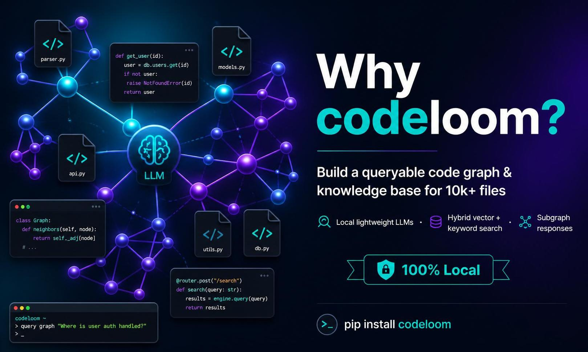

<p align="center">
<h1 align="center">codeloom</h1>
  <p align="center">
    "With codeloom, your coding agent knows what to read."
  </p>
</p>

<p align="center">
  <a href="https://github.com/algodesigner/codeloom/actions"></a>
  <a href="https://pypi.org/project/codeloom/"></a>
  <a href="https://github.com/algodesigner/codeloom/blob/main/LICENSE"></a>
  
  
</p>

<p align="center">
  
</p>

---

AI coding agents are powerful but fundamentally blind to your codebase structure. When your agent edits `validate_token()`, it has no idea that 47 callers depend on its return type. When it searches for "database connection", it greps blindly through every file. Without a code graph, your agent works like a surgeon operating without an X-ray, skilled but guessing at what's inside.

**codeloom** builds a queryable code graph from your entire codebase — extracting structure from **55 languages and formats**, every function, class, import, call, and document — and exposes it to your AI agent. One install, and your agent stops grepping and starts understanding.

## Quick Start

```bash
pip install codeloom

cd your-project/
codeloom install opencode    # for OpenCode
# or: codeloom install claude  # for Claude Code
```

Then tell your agent:

> "Build a code graph for this project"

That's it. The graph auto-rebuilds when your session ends. No extra tokens, no extra commands, everything runs 100% locally.

---

## What Changes

| Before (grep) | After (codeloom) |
|---|---|
| Finds exact strings, misses semantic connections | Finds conceptually related code via vector + keyword + graph |
| Returns a flat list of file matches | Returns seeds **plus a subgraph** showing how they connect |
| No way to know what depends on what | `codeloom impact "validate_token"`, finds all 47 callers instantly |
| Agent operates blind, guesses at relationships | Agent sees the full picture before making edits |

Every search returns results like this:

```
seeds:
codeloom/core/pipeline.py:71
  │ def run_pipeline(source_dir: Path, ...) -> PipelineResult:
  │     """Run the full code graph build pipeline."""
storage/store.py:20
  │ class KnowledgeStore:

edges:
codeloom/core/pipeline.py:71 -calls-> storage/store.py:20
codeloom/core/pipeline.py:0 -defines-> codeloom/core/pipeline.py:71
```

Seeds tell you *where* relevant code lives. Edges tell you *how it connects*. Together they give your agent the full picture, no separate Read calls needed.

---

## 15 MCP Tools at a Glance

Three categories, one MCP server.

### Search
| Tool | What it does |
|------|-------------|
| `search` | 5-signal HybridRAG, vector + keyword + graph + community fused into one ranking |
| `search_keyword` | FTS5 keyword-only (BM25), instant results for known names |
| `search_vector` | Semantic vector-only, finds conceptually similar code |

### Analysis
| Tool | What it does |
|------|-------------|
| `impact` | Blast radius, every caller that depends on a symbol |
| `dependencies` | Upstream deps, what a symbol needs to function |
| `context` | 360-degree view of a symbol, metadata, community, all edges, source snippet |
| `detect_changes` | Map unstaged git changes to affected graph nodes |
| `explain_flow` | Trace execution path through call chains |
| `stats` | Node/edge counts, kind distribution, god nodes |
| `communities` | Browse functional clusters (Leiden communities) |
| `node` | Details on a specific symbol with fuzzy name matching |

### Refactoring & Admin
| Tool | What it does |
|------|-------------|
| `rename` | Find every location and reference for safe multi-file rename |
| `export_subgraph` | Export focused subgraph around a symbol as D3.js JSON |
| `list_repos` | List available code graphs with staleness status |
| `build` | Build or rebuild the code graph |

All tools are available via MCP (stdin/stdout), no HTTP server, no network, no configuration.

---

## Languages & Formats

### Structural extraction (functions, classes, calls, imports)

Full tree-sitter tags.scm-based resolution for 17+ core languages. All 55 languages get module-level indexing, source snippets, and embeddings — structural detail depends on optional `tree-sitter-<lang>` packages.

| | | | | | | | |
|:---:|:---:|:---:|:---:|:---:|:---:|:---:|:---:|
| Ada | C | C# | C++ | Common Lisp | Elixir | Fortran | Go |
| Groovy | Haskell | Java | JavaScript | Julia | Kotlin | Lua | Nix |
| Objective-C | OCaml | Perl | PHP | PowerShell | Python | R | Ruby |
| Rust | Scala | Shell | Solidity | Swift | Terraform | TypeScript | Zig |

### Document & config extraction

| | | | | | |
|:---:|:---:|:---:|:---:|:---:|:---:|
| CMake | CSV | CSS | DjVu | Dockerfile | DOCX |
| GraphQL | HCL | HTML | JSON | Make | Markdown |
| ODP | ODS | ODT | Org | PDF | RST |
| SQL | TOML | XLSX | XML | YAML | |

Plus **100+ natural languages** for search queries via multilingual-e5-small embeddings. Search in any language, find results in any language.

---

## AI Agent Integrations

One command per platform:

| Agent | Install |
|-------|---------|
| **Claude Code** | `codeloom install claude` |
| **OpenCode** | `codeloom install opencode` |
| **Codex CLI** | `codeloom install codex` |
| **Gemini CLI** | `codeloom install gemini` |
| **Cursor IDE** | `codeloom install cursor` |
| **Windsurf IDE** | `codeloom install windsurf` |
| **Cline** | `codeloom install cline` |
| **Aider CLI** | `codeloom install aider` |
| **Any MCP client** | `claude mcp add codeloom -- codeloom mcp` |

Each `install` writes context rules and registers hooks where supported. For OpenCode, it also installs a plugin that **automatically injects graph context before grep/glob calls**, your agent gets results without having to ask. Remove with `codeloom uninstall <agent>`.

---

## Features

### Search Before Grepping
5-signal HybridRAG fuses code vector search, text vector search, graph expansion, FTS5 keyword, and community signals into one ranked result set with subgraph edges. `--kind`, `--file`, and `--include-tests` filters narrow results without re-running.

### Edit With Confidence
Run `impact` before editing to find every caller. Run `context` for a full symbol overview, community, all relationships, source snippet. Run `detect_changes` after edits to see which nodes are affected.

### Auto-Context (OpenCode)
The OpenCode plugin hooks into grep/glob calls, runs `codeloom search` with the query, and injects results directly into the agent's session, graph context appears automatically, no explicit invocation needed.

### Auto-Rebuild
Stop/SessionEnd hooks detect changed files via `git diff` and trigger an incremental rebuild. Lock files prevent concurrent rebuilds. Zero manual intervention, the graph stays fresh after every session.

### Incremental & Fast
SHA-256 content hashing skips unchanged files. Hot-start PageRank reuses previous importance scores. **Parallel extraction** (ProcessPoolExecutor) speeds up full builds by 24-64%. Typical incremental build: **~0.4s for no changes, ~4s for changes**, 95%+ faster than a full rebuild. **Model warmup** (`--warmup`, default on) preloads embedding models on MCP server start so the first search is fast — disable with `--no-warmup` to save ~150MB RAM.

### 100% Local + MIT
No cloud services, no API keys, no telemetry. SQLite + FAISS for storage, sentence-transformers for embeddings. All data stays on your machine. MIT licence, no commercial restrictions, no licensing friction.

---

## Performance

Benchmarks on a 2023 MacBook Pro (M2 Pro, 32GB RAM). All builds use
parallel extraction (default: `os.cpu_count()` workers).

### codeloom's own codebase (~3,500 lines, 90 files, 1,300 nodes)

| Operation | Time |
|-----------|------|
| Full build | ~14s |
| Incremental (changes) | ~4s |
| Incremental (no changes) | ~0.4s |
| Cold search (dual model) | ~2.8s |
| Cold search (`--fast`) | ~0.2s |
| Warm search | ~0.08s |
| Cached search | <1ms |

### Synthetic stress tests (no embeddings)

| Dataset | Files | Nodes | Build Time | Peak Memory |
|---------|-------|-------|-----------|-------------|
| Tiny | 10 | 119 | **0.7s** | 14 MB |
| Small | 100 | 4,109 | **2.3s** | 16 MB |
| Medium | 1,000 | 101,009 | **53.1s** | 393 MB |
| Large | 5,000 | 205,009 | **164.9s** | 814 MB |

Parallel extraction delivers 24-64% faster builds. Compact node storage
(path interning, skipped empty attrs, RAM-free source snippets after
persist) reduces peak memory by 10-22%. See `docs/SCALING.md` for
detailed analysis.

- **Embedding models**: ~180MB, downloaded once to `~/.codeloom/models/`
- **Database**: ~2MB (SQLite + FTS5 + FAISS indices)

---

## Full CLI Reference

All commands output compact text by default (designed for AI agent consumption).

### CLI Commands

| Command | Description |
|---------|-------------|
| `build <dir>` | Build code graph (`--incremental`, `--git`) |
| `watch <dir>` | Real-time file system monitor |
| `search <query>` | 5-signal HybridRAG with subgraph + snippets |
| `search-keyword <query>` | FTS5 keyword matching only |
| `search-vector <query>` | Vector similarity only |
| `search-graph <query>` | Graph expansion only (BFS from vector seeds) |
| `search-community <query>` | Community cluster matching only |
| `stats` | Graph statistics |
| `node <id>` | Node details with fuzzy matching |
| `communities` | List or search communities |
| `query` | Interactive search REPL |
| `export` | Export as JSON, GraphML, or D3.js |
| `visualize` | Interactive HTML visualization |
| `install [agent]` | Install codeloom integration for AI agents |
| `uninstall [agent]` | Remove codeloom integration for AI agents |
| `doctor` | Check installation health |
| `clean` | Remove `.codeloom/` database |
| `mcp` | Start MCP server |
| `help [command]` | Show categorised help with usage examples |

### MCP-Only Tools

These are available via `codeloom mcp` — see the [MCP tools section](#15-mcp-tools-at-a-glance) above:

`impact` · `dependencies` · `context` · `detect_changes` · `rename` · `explain_flow` · `export_subgraph` · `list_repos`

---

## Requirements

- Python 3.10+
- ~180MB disk for embedding models (cached on first use)

```bash
# Optional: PDF, DOCX, XLSX, ODF extraction
pip install codeloom[docs]
```

## Development

```bash
pip install -e ".[dev]"
pytest
ruff check codeloom/
```

## License

MIT License. See [LICENSE](LICENSE) for details.

## Contributing

Contributions are welcome! See [CONTRIBUTING.md](CONTRIBUTING.md) for guidelines.
